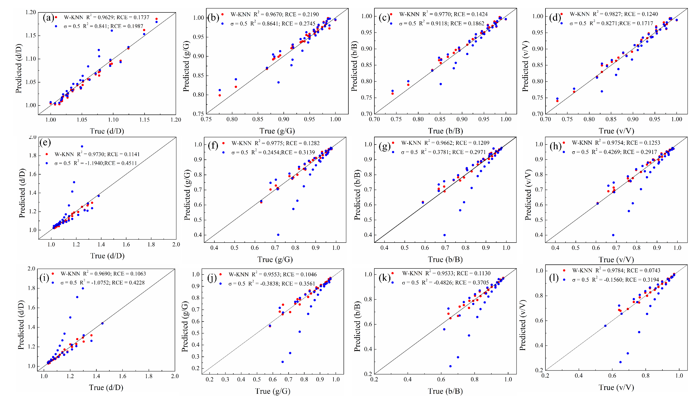

# Quantifying and predicting information loss in digital microstructure: An integrated experimental, simulation, and machine learning framework
## Abstract
 This repository contains the complete code for dataset construction, model training, and testing workflows, along with the corresponding raw data (training and test sets) and pre-trained parameter files.
 ## Dataset
1. High-resolution ground truth microstructures for different shape parameters are stored in the `ground_truth` folder. The `down_sampled.m` file can be used to downsample these to generate lower resolutions. 
2. Microstructures at various resolutions can be processed using the `delect_big_denoise.m` script with different size thresholds.
3. The `size_topology.m` script computes the geometric and topological structures of the microstructures.
4. `tpzuhe.m`: Combines statistical microstructure information into an Excel.
5. Training datasets with different size thresholds are located in the `training_dataset` folder, while test datasets are in the `test_dataset` folder.
  ## FWKNN
1. The FWKNN implementation is located in `FWKNN.py`, and `test.py` is used to evaluate the training performance.
2. The `Indicators.m` script is used to calculate R2and RCE.
3. The trained parameter files are located in the `models` folder.
The model's results on the test set are shown as the red points in the figure.

 ## Grain track
 1. The `segnment_label.m` script segments the microstructures and generates label files.
 2. The `delect_big_denoise_label.m` script is used to process the label files.

